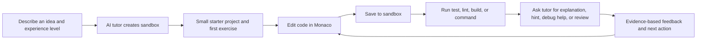
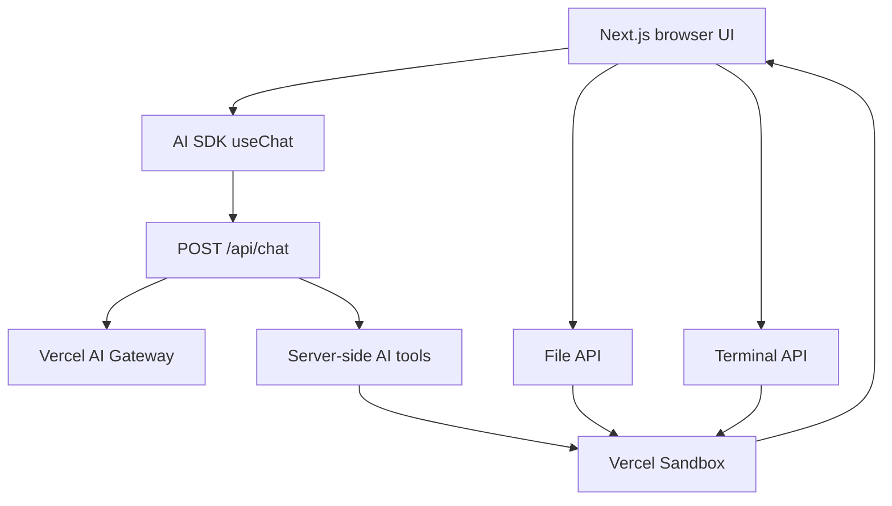

# CodeTutor Studio: product and technical specification

## 1. Product summary

CodeTutor Studio is an AI-powered coding workspace designed for learning by building. A learner describes what they want to create, and the tutor creates an isolated development sandbox, introduces a small exercise, and guides the learner through editing, testing, debugging, and reviewing their own code.

The product is intentionally different from a one-shot code generator. The learner remains the author of the work. The tutor explains concepts, reads the current saved code, runs evidence-based checks, asks questions, and provides bounded next steps.

### One-sentence pitch

> An AI code tutor that turns a project idea into an editable sandbox, then teaches the learner to build, test, and understand it.

### Primary value

| Audience | Problem | CodeTutor Studio response |
| --- | --- | --- |
| Beginner developer | Generated code is difficult to understand or modify. | Teaches concepts in short steps and offers line/file/project explanations. |
| Student | Feedback is delayed or vague. | Runs real checks and gives feedback based on the learner’s actual saved code. |
| Self-directed learner | Setting up projects, tools, and terminals is distracting. | Opens an isolated sandbox with editor, terminal, and preview in one workspace. |
| Instructor or program | It is difficult to offer individual code feedback at scale. | Provides a repeatable assessment and tutoring workflow. |

## 2. Product principles

1. **Learner ownership** — the tutor must not silently replace student work.
2. **Evidence before feedback** — code reviews and assessments read the latest saved files and run relevant checks.
3. **Small, observable steps** — every teaching response should end with a concrete edit, command, or question.
4. **Real engineering workflow** — learners work with source files, commands, tests, builds, and previews instead of a simulated code exercise.
5. **Safe execution** — generated and user-created projects run in a sandbox, not in the application server.
6. **Focused interface** — the interface prioritizes the active task, source code, and terminal rather than dashboards or gamification.

## 3. Core user experience

### Primary learning flow



### Main workspace

The product uses a two-panel coding workspace.

| Area | Purpose |
| --- | --- |
| Header | Shows product identity, local workspace context, and help access. |
| Tutor panel | Holds the task conversation, starter prompts, model picker, tutor actions, and message composer. |
| Tutor actions | Quick requests such as Explain project, Explain file, Explain line, Quiz me, Review changes, Help debug, and Give a hint. |
| Workspace panel | Switches between source code and web preview. |
| File explorer | Shows sandbox files and folders; supports file and directory creation. |
| Monaco editor | Supports source editing, save, revert, and side-by-side saved-versus-draft changes. |
| Student terminal | Runs user-entered commands and streams command logs. |

### Empty state

Before a sandbox is available, the tutor panel invites the learner to describe a project. The editor shows an explanatory empty state. The file creation button opens a guided “Start a workspace” action rather than appearing silently disabled.

### File and folder workflow

1. Select **Add** in the editor header.
2. If no sandbox exists, select **Create blank workspace**.
3. Once a sandbox is ready, choose **File** or **Folder**.
4. Enter a relative path, for example `src/components/Card.tsx` or `src/components`.
5. The app validates the path, creates the sandbox item, and adds it to the file tree.
6. New files open automatically in Monaco.

## 4. Tutor behavior

The tutor is governed by a teaching contract in `app/api/chat/prompt.md`.

### Required tutor behavior

- Identify or reasonably infer the learner’s goal and experience level.
- Break work into small milestones.
- Explain the purpose and mental model before assigning an edit.
- Give the learner a concrete turn rather than immediately generating the full solution.
- Prefer hints and questions before complete solutions.
- End a teaching response with a clear next action.
- Read current sandbox files before reviewing, explaining, assessing, or modifying existing code.
- Run relevant tests, lint, type-check, or build commands before stating that work is correct.

### Tutor quick actions

| Action | Tutor request | Expected result |
| --- | --- | --- |
| Explain project | Read key source files and explain architecture and runtime flow. | Codebase walkthrough plus comprehension questions. |
| Explain file | Read the active file and explain it section by section. | Beginner-friendly file explanation. |
| Explain line | Read the active file, then request a line number or snippet. | Precise explanation of one statement and its consequences. |
| Quiz me | Read relevant implementation and ask one question at a time. | Active-recall practice with hints. |
| Review changes | Read current code and identify strengths plus one improvement. | Bounded code-review feedback. |
| Help debug | Read code, run the useful check, and explain the evidence. | One small fix to try without editing learner code. |
| Give a hint | Read relevant code and give one next step. | Guidance without revealing the solution. |

### Assessment format

When the learner asks for an assessment, the tutor should provide:

- Verdict: working, partially working, or not yet working.
- Rubric: correctness (40%), readability/understanding (25%), tests (20%), robustness (15%).
- Concrete strengths with paths and code decisions.
- Specific improvement points with evidence from code or command output.
- One bounded next exercise.

## 5. Functional requirements

### Project and sandbox lifecycle

| ID | Requirement |
| --- | --- |
| FR-1 | The tutor creates one sandbox for a learning session and reuses it for subsequent work. |
| FR-2 | The sandbox can expose development ports for live previews. |
| FR-3 | The learner can see files generated by the tutor. |
| FR-4 | The learner can create files and folders with validated relative paths. |
| FR-5 | The learner can edit and save files to the sandbox. |
| FR-6 | The learner can execute terminal commands in the sandbox. |
| FR-7 | Command state and output are visible to the learner. |

### Tutoring requirements

| ID | Requirement |
| --- | --- |
| TR-1 | The tutor can create a starter project and first exercise. |
| TR-2 | The tutor can read selected sandbox files. |
| TR-3 | The tutor can generate targeted files when asked. |
| TR-4 | The tutor can run commands and retrieve an exposed preview URL. |
| TR-5 | Tutor explanations must refer to current saved sandbox content rather than stale chat context. |
| TR-6 | Tutor review and assessment requests do not edit learner files unless explicitly asked. |

### Workspace requirements

| ID | Requirement |
| --- | --- |
| WR-1 | Monaco provides editable source code with language detection. |
| WR-2 | The editor supports `Cmd/Ctrl + S` and a save button. |
| WR-3 | Unsaved changes are visible and can be reverted. |
| WR-4 | The Changes mode compares saved code with the current draft. |
| WR-5 | The terminal allows commands only when the sandbox is running. |
| WR-6 | A model picker allows the learner to choose the tutor model for subsequent responses. |

## 6. Technical architecture



### Major modules

| Area | Key files | Responsibility |
| --- | --- | --- |
| Page shell | `app/page.tsx`, `app/header.tsx` | Workspace layout and header. |
| Tutor chat | `app/chat.tsx` | Conversation, prompt submission, model selection, tutor action dispatch. |
| Tutor actions | `components/tutor/code-tutor-actions.tsx` | Contextual one-click teaching requests. |
| AI route | `app/api/chat/route.ts` | Streams tutor responses and tool calls. |
| Tutor policy | `app/api/chat/prompt.md` | Defines the teaching and assessment behavior. |
| AI tools | `ai/tools/*` | Creates sandbox, reads files, writes files, runs commands, and gets preview URLs. |
| Sandbox credentials | `ai/sandbox.ts` | Builds explicit server-side Vercel Sandbox credentials. |
| Workspace | `app/workbench.tsx` | Code/preview tabs and editor/terminal split. |
| File explorer | `components/file-explorer/*` | File tree, creation controls, Monaco integration. |
| Terminal | `components/commands-logs/*`, `app/api/sandboxes/[sandboxId]/terminal/route.ts` | Command execution and log rendering. |
| Sandbox file API | `app/api/sandboxes/[sandboxId]/files/route.ts` | Read, update, create file, and create folder operations. |
| Client state | `app/state.ts` | Sandbox ID, paths, selected file, generated files, commands, and runtime status. |

### Data flow: save an edited file

1. Monaco updates the component’s local draft state.
2. The learner saves with `Cmd/Ctrl + S` or **Save**.
3. The UI calls `PUT /api/sandboxes/:sandboxId/files`.
4. The route validates the relative path and calls `Sandbox.writeFiles`.
5. The saved editor value becomes the baseline for the Monaco diff view.
6. Later tutor reviews use the `readFiles` tool to fetch the saved sandbox source.

### Data flow: run a terminal command

1. The learner enters a command in the student terminal.
2. The UI posts to `POST /api/sandboxes/:sandboxId/terminal`.
3. The route starts `sh -lc <command>` in the sandbox.
4. The command ID is stored in client state.
5. Command status and log endpoints stream output to the terminal panel.

## 7. API surface

| Route | Method | Purpose |
| --- | --- | --- |
| `/api/chat` | `POST` | Streams AI tutor responses and tool events. |
| `/api/models` | `GET` | Lists available AI Gateway models for the picker. |
| `/api/errors` | `POST` | Reports detected runtime/build errors for tutor assistance. |
| `/api/sandboxes/:sandboxId/files?path=` | `GET` | Reads a sandbox file. |
| `/api/sandboxes/:sandboxId/files` | `PUT` | Saves a text file. |
| `/api/sandboxes/:sandboxId/files` | `POST` | Creates an empty file or a real directory. |
| `/api/sandboxes/:sandboxId/terminal` | `POST` | Starts a learner-entered command. |
| `/api/sandboxes/:sandboxId/cmds/:cmdId` | `GET` | Reads command completion state. |
| `/api/sandboxes/:sandboxId/cmds/:cmdId/logs` | `GET` | Streams command logs as NDJSON. |
| `/api/sandboxes/:sandboxId` | `GET` | Checks whether a sandbox is running. |

## 8. Technology stack

| Layer | Technology | Why it is used |
| --- | --- | --- |
| Framework | Next.js 16, App Router | Full-stack React application with route handlers. |
| UI | React 19, Tailwind CSS, shadcn/ui | Composable interface primitives and utility styling. |
| AI | AI SDK 6, Vercel AI Gateway | Model selection, streaming chat, and server-side tool calling. |
| Execution | Vercel Sandbox | Isolated environment for generated code, files, commands, and preview ports. |
| Editor | Monaco Editor | Familiar programmable editor with language support and keyboard editing. |
| State | Zustand | Lightweight shared client state for the active sandbox workspace. |
| Client fetching | SWR | Fetches editable file content and supports local mutation after save. |
| Markdown/code presentation | Streamdown, Shiki | Streams assistant text and highlights code content. |

## 9. Local configuration

Create a non-committed `.env.local` file. Never expose these values in `NEXT_PUBLIC_` variables.

```bash
AI_GATEWAY_API_KEY=...
VERCEL_AUTH_TOKEN=...
VERCEL_TEAM_ID=...
VERCEL_PROJECT_ID=...
```

| Variable | Used by | Notes |
| --- | --- | --- |
| `AI_GATEWAY_API_KEY` | AI Gateway | Enables model responses. |
| `VERCEL_AUTH_TOKEN` | Vercel Sandbox SDK | Local API-token authentication for sandbox operations. |
| `VERCEL_TEAM_ID` | Vercel Sandbox SDK | Required alongside an API token. |
| `VERCEL_PROJECT_ID` | Vercel Sandbox SDK | Identifies the sandbox-enabled Vercel project. |

For a true short-lived Vercel OIDC JWT in local development, use `vercel env pull .env.local --yes`; do not place a `vcp_` API token in `VERCEL_OIDC_TOKEN`.

### Commands

```bash
pnpm install
pnpm dev
pnpm lint
pnpm type-check
pnpm build
```

## 10. Security and safety

### Current safeguards

- Sandbox credentials are server-only environment variables.
- The application does not use `NEXT_PUBLIC_` for tokens.
- Code runs in Vercel Sandbox rather than in the Next.js server process.
- File paths are limited to relative paths and reject traversal components such as `..`.
- The tutor policy requires saved-code reads before assessments and prohibits silent student-work replacement.
- Empty file/folder creation validates user paths before calling the sandbox.

### Recommended hardening before production

1. Add authentication and per-user authorization around every sandbox API route.
2. Persist sandbox ownership and deny access to sandbox IDs not owned by the current user.
3. Rate-limit chat, sandbox creation, file writes, and terminal execution.
4. Enforce command allowlists or policy levels for beginner workspaces.
5. Add command resource limits, sandbox expiry notices, and cost limits.
6. Audit file write, command, and tutor assessment events.
7. Avoid returning raw sandbox errors directly to browser clients.
8. Add an explicit consent step before the tutor modifies learner-authored files.

## 11. Current scope and known gaps

The product currently provides a working local learning loop, but the following are not yet productized:

| Gap | Impact | Recommended next step |
| --- | --- | --- |
| No login or learner accounts | Workspaces cannot be securely assigned to individuals. | Add authentication and sandbox ownership records. |
| No durable lesson history | Chat and project state are session-oriented. | Persist threads, sandbox metadata, milestones, and assessments in a database. |
| No curriculum management | Teaching is prompt-driven rather than course-driven. | Add templates, lesson goals, skill prerequisites, and instructor-managed tracks. |
| No structured test-results UI | Learners read generic terminal output. | Add AI Elements Test Results and Stack Trace components. |
| No code-selection bridge | Explain line asks for a line number/snippet. | Connect Monaco cursor/selection to tutor-action context. |
| No collaboration features | No instructor or peer visibility. | Add shareable read-only project reviews and educator dashboards. |
| No analytics | Learning outcomes are not measured. | Track attempts, checks, assessment outcome, and time-to-completion. |

## 12. Recommended product roadmap

### Phase 1: dependable single-learner workspace

- Add user sign-in and sandbox ownership.
- Persist chat sessions and project metadata.
- Make sandbox create/start/stop status explicit.
- Add structured test result and stack trace displays.
- Capture Monaco line selection for Explain line.

### Phase 2: curriculum and assessment

- Create reusable project templates by difficulty and language.
- Add explicit learning objectives and prerequisite tags.
- Store rubric assessments and learner progress.
- Add teacher/instructor view with project review links.
- Add retry plans after failed checks.

### Phase 3: collaborative learning platform

- Cohorts, assignments, due dates, and instructor feedback.
- Peer review workflows with safe read-only access.
- Shared lesson libraries and organization-level templates.
- Usage controls and billing for sandbox/AI consumption.
- Analytics for engagement, comprehension, and completion.

## 13. Success metrics

### Learning metrics

- Percentage of learners who complete the first exercise.
- Number of successful test/lint/build runs per project.
- Improvement between first and final assessment rubric score.
- Percentage of learners who can answer follow-up comprehension questions.

### Product metrics

- Time from project prompt to editable sandbox.
- Sandbox creation success rate.
- Tutor response and tool-call completion rate.
- File save and terminal command success rate.
- Session retention and project return rate.

### Quality metrics

- Hydration/runtime error rate.
- Failed sandbox API request rate.
- Average command duration and timeout rate.
- AI tutor action usage by type.
- Incidents where the tutor edits learner code without explicit consent (target: zero).

## 14. Suggested future project brief

Use this brief when presenting or extending the product:

> Build CodeTutor Studio, an AI-powered development environment where learners create real projects in isolated sandboxes. The system should pair a streaming AI tutor with an editable Monaco code workspace, terminal, file management, preview, evidence-based reviews, and structured learning actions. The tutor must teach through small steps, respect learner ownership, read the actual saved code before offering feedback, and use tests or commands as evidence. The long-term platform should support authentication, saved project history, reusable curricula, instructor oversight, and measurable learning outcomes.

## 15. Repository map

```text
app/
  api/                       # Chat, model, sandbox, command, and file routes
  chat.tsx                   # Tutor conversation and composer
  file-explorer.tsx          # Store-connected editor wrapper
  workbench.tsx              # Code, preview, and terminal workspace
  state.ts                   # Shared sandbox state
ai/
  sandbox.ts                 # Server-side Sandbox credentials
  tools/                     # AI tool definitions
components/
  ai-elements/               # Conversation, suggestions, loader patterns
  file-explorer/             # File tree, Monaco, diff, creation controls
  tutor/                     # Contextual tutor quick actions
  commands-logs/             # Terminal and log streaming UI
docs/
  product-spec.md            # This document
  ai-elements-audit.md       # AI Elements component map and future ideas
```
